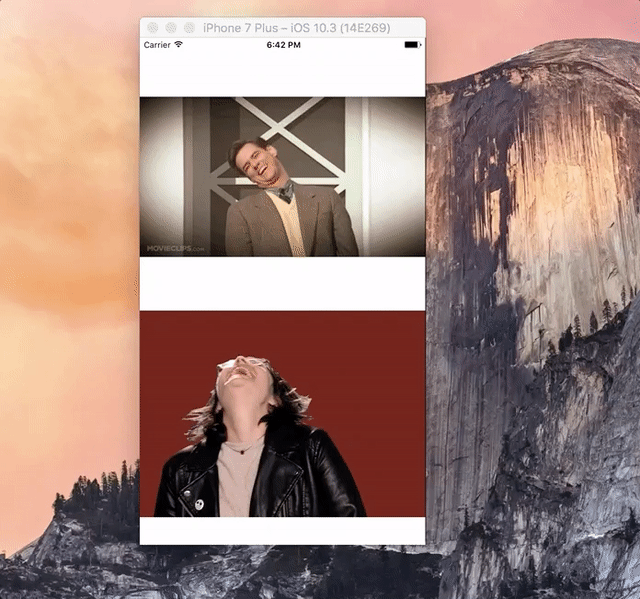

# GifExt

**Proudly animate Gif on iOS with less than 100 lines of code.**




Basically this is a copycat of [SwiftGif](https://github.com/bahlo/SwiftGif). Differences:

1. Play gif as it is. 
2. UIImageView load gif from URL.


## Usage

Since this is just an Extension, you can just 

1. download the GifExt.swift file 
2. add it to your project.
3. use it like this:

```
// create animated UIImage
let localGifURL = Bundle.main.url(forResource: "laugh", withExtension: "gif")
let gifFile = UIImage.gif(url:localGifURL!)
localImageView.image = gifFile

// or just load from web
let webGifURL = URL(string: "https://media.giphy.com/media/3og0IuvANdUUmpVeA8/giphy.gif")
webImageView.loadGif(url: webGifURL!)
```


